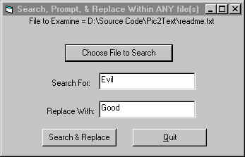



## Find, Prompt, & Replace String \(Anywhere\)

### Description

This code example will search within any file (even binaries), of your choice, for a string of your chioce, and replace it, with another string of your choice. when it finds a Match to your search, it will Display the last 128 Characters which contain your string. Then it'll Propmt you if you'd like to change this instance(s) of your String. If not, it'll travel onto the next Instance, Display new results, and Prompt you again... I Originally used it in Access VBA, to Insert SQL Formatted dates, into Select statements within SQL Files, before sending them to the pl/sql server. It only took a few moments for me to convert this to work with any filetype. Note that the Replace String shouldn't be longer than the Search String (Commented in Code).
 
### More Info
 

             |
---                |---
**Submitted On**   |2002-02-21 16:14:30
**By**             |[Zaphod](https://github.com/Planet-Source-Code/PSCIndex/blob/master/ByAuthor/zaphod.md)
**Level**          |Intermediate
**User Rating**    |5.0 (10 globes from 2 users)
**Compatibility**  |VB 5\.0, VB 6\.0, VBA MS Access
**Category**       |[Complete Applications](https://github.com/Planet-Source-Code/PSCIndex/blob/master/ByCategory/complete-applications__1-27.md)
**World**          |[Visual Basic](https://github.com/Planet-Source-Code/PSCIndex/blob/master/ByWorld/visual-basic.md)
**Archive File**   |[Find,\_Prom567092212002\.zip](https://github.com/Planet-Source-Code/zaphod-find-prompt-replace-string-anywhere__1-32004/archive/master.zip)

